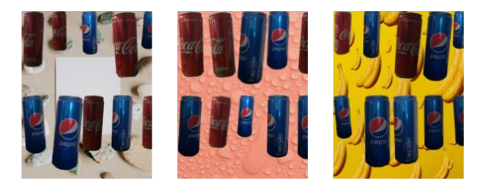

# TFOD-utils

TFOD-utils is a repository containing a collection of utility functions for working with TensorFlow Object Detection (TFOD) models. It provides various functionalities to streamline common tasks related to object detection model training and data preparation. 
## Features

TFOD-utils offers the following functionalities:

- **Labelmap Generation**: Generate a labelmap file, which defines the classes or labels used in the object detection model.

- **TF Records Generation**: Create TensorFlow records from annotated datasets, a required format for training TFOD models.

- **Train-Test Data Split**: Split the images into train and test folders, facilitating the creation of separate datasets for model training and evaluation.

- **Video to Image Conversion**: Extract frames from videos and generate images, allowing the use of video data in object detection tasks.

- **Image Resizing**: Resize images to desired dimensions, ensuring consistency and compatibility with the TFOD model requirements.

## Usage

The TFOD-utils project consists of various Python scripts, each catering to a specific utility function. To use a particular function, follow the instructions below:

### 1. Generate Labelmap

**Script:** generate_labelmap.py

**Description:** This script generates a labelmap file (.pbtxt) that defines the classes or labels used in the object detection model.

**Usage:**

```shell
python generate_labelmap.py -l <label1> <label2> ... -p <output_path>
```

**Arguments:**

- `-l`, `--labels`: List of labels for the classes (separated by spaces).
- `-p`, `--path`: Output path for the labelmap file.

### 2. Generate TF Records

**Script:** generate_tfrecord.py

**Description:** This script converts annotated XML files to TFRecord files, which are the required format for training TFOD models.

**Usage:**

```shell
python generate_tfrecord.py -x <xml_dir> -l <labels_path> -o <output_path> -i <image_dir> -c <csv_path>
```

**Arguments:**

- `-x`, `--xml_dir`: Path to the folder containing the input XML files.
- `-l`, `--labels_path`: Path to the labels (.pbtxt) file.
- `-o`, `--output_path`: Path for the output TFRecord (.record) file.
- `-i`, `--image_dir` (optional): Path to the folder containing the input image files. Defaults to the same directory as `xml_dir`.
- `-c`, `--csv_path` (optional): Path for the output CSV file. If not provided, no CSV file will be written.

### 3. Train-Test Data Split

**Script:** train_test_split.py

**Description:** This script splits the collected images into train and test folders based on a specified test size.

**Usage:**

```shell
python train_test_split.py -c <collected_path> -t <train_path> -e <test_path> -s <test_size>
```

**Arguments:**

- `-c`, `--collected_path`: Path to the directory containing the collected images.
- `-t`, `--train_path`: Path to the directory where the train images will be saved.
- `-e`, `--test_path`: Path to the directory where the test images will be saved.
- `-s`, `--test_size` (optional): Test size as a fraction (e.g., 0.2 for 20%). Defaults to 0.2 if not provided.

### 4. Video to Image Conversion

**Script:** video_to_image.py

**Description:** This script extracts frames from videos and saves them as individual images.

**Usage:**

```shell
python video_to_image.py -s <source_path> -d <destination_path>
```

**Arguments:**

- `-s`, `--source_path`: Path to the directory containing the video files.
- `-d`, `--destination_path`: Path to the directory where the generated images will be saved.

### 5. Image Resizing

**Script:** resizer.py

**Description:** This script resizes images in a directory to a specified scale factor.

**Usage:**

```shell
python resizer.py -p <dir_path> -s <scale_factor>
```

**Arguments:**

- `-p`, `--dir_path`: Path to the directory containing the images.
- `-s`, `--scale_factor`: Scale factor to resize the images. Defaults to 0.25 if not provided.

### 6. Update Config File

**Script:** update_config_file.py

**Description:** This script updates the configuration file of a TFOD model with the desired settings.

**Usage:**

```shell
python update_config_file.py -w <network_architecture> -p <pipeline_config> -m <label_map> -t <pre_model_path> -n <pre_model_name> -a <annotation_path> -c <num_classes> -b <batch_size>
```

**Arguments:**

- `-w`, `--network_architecture`: Network architecture of the TFOD model (e.g., sdd, center_net, faster_rcnn).
- `-p`, `--pipeline_config`: Path to the pipeline configuration file.
- `-m`, `--label_map`: Path to the labelmap file.
- `-t`, `--pre_model_path`: Path to the folder containing the pretrained model.
- `-n`, `--pre_model_name`: Name of the pretrained model.
- `-a`, `--annotation_path`: Path to the annotation folder.
- `-c`, `--num_classes`: Number of classes in the dataset.
- `-b`, `--batch_size`: Batch size for training.

### 7. Generate Synthetic Images 

**Script:** generate_synthetic_images_v2.py

**Description:** A script creates synthetic images by combining backgrounds and masks, applying random transformations to the masks, and pasting them onto the backgrounds at random positions. 
Transformations: brightness, blur, rotation, and mask size.

**Usage:**

```shell
python generate_synthetic_images_v2.py -p <path_to_images> -n <number_of_images>
```

**Arguments:**
 - `-p`, --path: Path to the directory containing the background and mask images.
 - `-n`, --number_img: Number of random images to generate.

Examples of the synthetic images created by the script:




